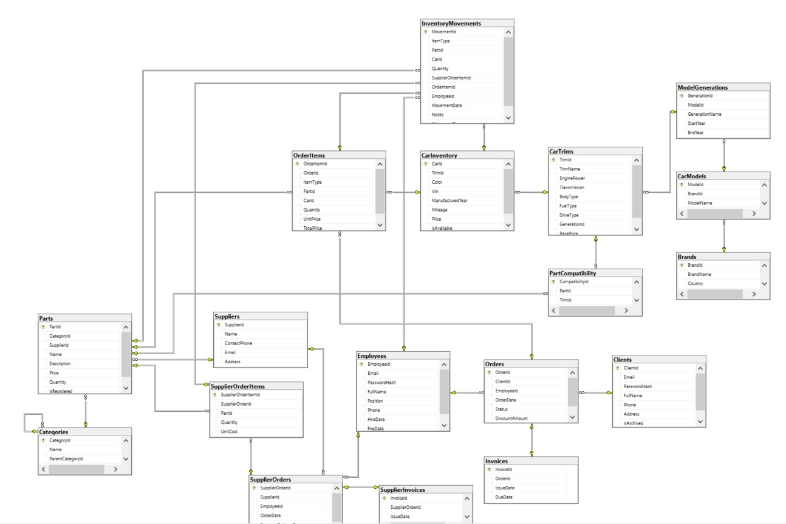

# CarDealership — SQL-ядро автодилерского центра

Транзакционная БД для автодилера: продажа авто и запчастей, Trade‑In, динамические скидки, автоматические заказы поставщикам, полный аудит движений.

**Стек:** MS SQL Server, T-SQL  
**Цель в портфолио:** демонстрация продвинутых SQL-навыков — транзакции, триггеры, TVP, сложная бизнес-логика на уровне БД.

---

## Схема базы данных



---

## Ключевые технологии

| Технология | Задача |
|------------|--------|
| Транзакции + TRY/CATCH + THROW | Атомарность операций (заказ, Trade‑In) |
| Триггеры (FOR / INSTEAD OF) | Авто-резервирование, запрет изменений выполненных заказов, авто-заказ запчастей |
| CONTEXT_INFO | Защита audit-таблицы от случайного удаления |
| Табличные параметры (TVP) | Передача сложных структур за 1 вызов |
| OUTPUT INTO | Получение ID созданных записей без второго запроса |
| Функции (скалярные / табличные) | Переиспользуемая логика (скидки, оценка Trade‑In) |
| Представления | Витрины для клиентов и аналитики |
| Хранимые процедуры | API базы для внешних вызовов |

---

## Возможности проекта

### 1. Продажа автомобилей и запчастей
Оформление заказов с одновременным включением авто (штучный товар) и запчастей (количественный). При создании — проверка остатков и автоматическое резервирование. При подтверждении (completed) — списание через журнал движений и генерация счёт-фактуры. Триггеры блокируют добавление товаров в закрытые заказы и изменение выполненных статусов.

### 2. Trade‑In с автоматической оценкой
Приём старого авто в счёт оплаты нового. Оценка стоимости рассчитывается функцией на основе возраста и пробега (с понижающими коэффициентами и минимальным порогом 10%). Процедура добавляет БУ авто в инвентарь, создаёт заказ на новый автомобиль и применяет оценочную стоимость как дисконт.

### 3. Динамическая клиентская скидка
Скидка рассчитывается функцией на основе истории клиента: количество заказов, общая сумма трат, давность регистрации и регулярность покупок. Итоговый размер ограничен 10% от суммы заказа.

### 4. Автоматические заказы поставщикам
При падении остатка запчасти ниже порогового значения (MinStockThreshold в категории) триггер создаёт заказ поставщику на пополнение. Заказы группируются по поставщикам — один вызов процедуры создаёт отдельные SupplierOrder для каждого.

### 5. Полный аудит движений товаров
Таблица InventoryMovements — журнал проводок. Продажа, приход, резерв, отмена резерва, корректировка — каждая операция фиксируется с типом и ссылкой на документ. Количество в Parts пересчитывается только через триггеры на InventoryMovements, исключая «незаметное» изменение остатков.

---
## Быстрый старт
Проект поставляется как самодостаточный SQL-скрипт. Для развёртывания потребуется MS SQL Server (2019+).

### Шаг 1. Создание базы данных

```sql
CREATE DATABASE CarDealership;
GO
USE CarDealership;
GO
```

### Шаг 2. Инициализация схемы
Выполните файл **init.sql** — он создаст: все необходимы таблицы и заполнит их тестовыми данными, а также все триггеры, процедуры, функции, представления и TVP.
После выполнения вы получите полностью работающую БД с тестовыми данными (40+ авто, 50+ запчастей, 20 клиентов).

### Тестирование и проверка логики
Проект включает демонстрационный скрипт **test.sql**, который последовательно проверяет ключевые сценарии.
## Публичное API

### Основные процедуры

| Процедура | Назначение |
|-----------|------------|
| usp_CreateCustomerOrder | Создать заказ (авто + запчасти) |
| usp_TradeInCar | Полный цикл Trade‑In |
| usp_GetSalesReport | Отчёт по продажам за период |
| usp_CreateSupplierOrders | Массовый заказ поставщикам |
| usp_FindPartsForCar | Поиск запчастей по авто |

### Основные функции

| Функция | Назначение |
|---------|------------|
| FN_CalculateClientDiscount | Расчёт скидки |
| FN_CalculateCarCost | Оценка БУ авто |
| FN_GetMyOrders | Заказы клиента (табличная) |

### Публичные представления

| Представление | Содержание |
|---------------|------------|
| VW_AllAvailableCars | Каталог новых и БУ авто |
| VW_AvailableParts | Доступные запчасти с совместимостью |
| VW_ClientsStatus | Клиенты с тегами VIP/Постоянный/Новый |
| VW_TopSellingCars / VW_TopSellingParts | Аналитика продаж |

---

## Масштаб

| Показатель | Значение |
|------------|----------|
| Таблицы | 19 |
| Триггеры | 21 |
| Процедуры | 14 |
| Функции | 6 |
| Представления | 8 |
| TVP | 5 |
| Авто в каталоге | 40+ |
| Запчасти | 50+ |
| Клиенты | 20 |
| Сотрудники | 10 |
| Тестовые строки | 500+ |
